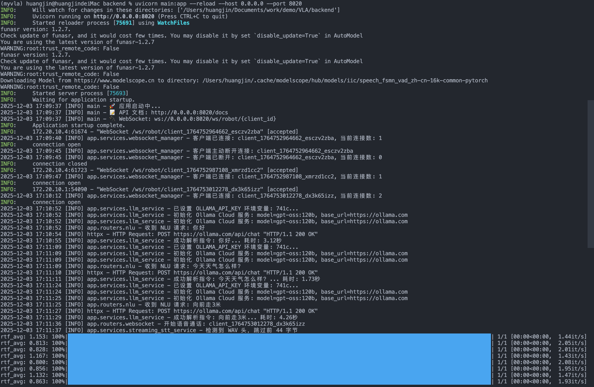
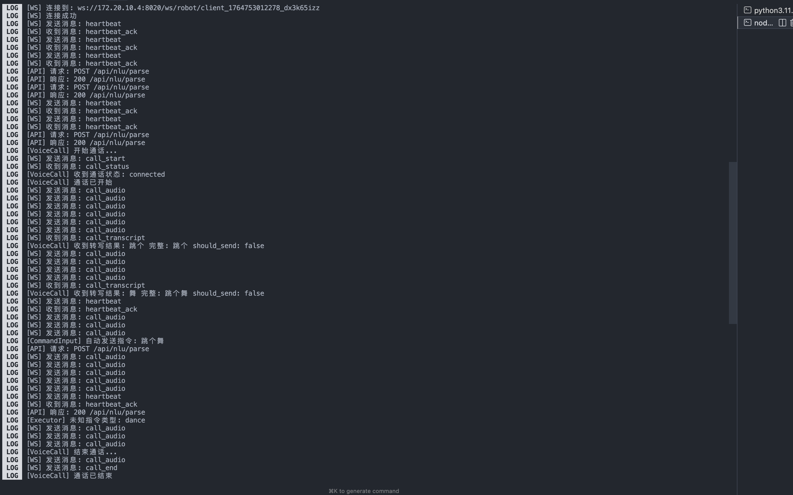

# SpeakBot 🎤🤖

> 用自然语言控制机器人 — 说话，它就动

[](https://opensource.org/licenses/MIT)
[](https://www.python.org/)
[](https://reactnative.dev/)

SpeakBot 是一个开源的机器人自然语言控制系统。用户通过手机 App 使用**语音或文字**与机器人交互，系统基于 LLM 将自然语言智能解析为机器人可执行的标准指令。

* *理论上，只要有了标准指令，若机器人硬件具备相应的指令接口及执行能力，即可完成对应动作。（目前因缺少实际硬件，👻So...）*

## ✨ 特性

- 🧠 **智能语义理解** — 基于 Ollama Cloud LLM，准确理解复杂指令
- 🎤 **双模式语音识别** — 非流式（10s 音频 70ms 处理，比 Whisper 快 15 倍）+ 流式（300 - 600ms 延迟实时转写）
- ⌨️ **文本输入** — 自然语言直接输入，无需记忆指令格式
- 🔌 **实时通信** — WebSocket 双向通信，指令状态实时反馈
- 📱 **跨平台** — React Native + Expo，iOS/Android 一套代码

## 📸 演示

### 功能演示视频

📹 [点击查看演示视频](./ScreenRecording-1.MP4)

### 控制台日志

| 后端日志 | 移动端日志 |
|:---:|:---:|
|  |  |

## 🎯 工作原理

```
用户输入                    智能解析                     机器人执行
───────────────────────────────────────────────────────────────────
"帮我拿桌上的杯子"    →    LLM 语义理解    →    [定位杯子, 移动, 抓取]
     ↑                         ↑                        ↓
   语音/文字               指令拆解               WebSocket 下发
```

**示例：复杂指令自动拆解**

```
输入: "帮我拿桌上的杯子"

输出:
├── 1. detect_object  →  定位"杯子"在"桌上"
├── 2. walk           →  移动到目标位置
└── 3. grab           →  抓取杯子
```

## 🏗️ 架构

```
┌────────────────────────────────────┐
│         Mobile App (Expo)          │
│   React Native + TypeScript        │
│   NativeWind + Zustand             │
└──────────────┬─────────────────────┘
               │ HTTP / WebSocket
               ▼
┌────────────────────────────────────┐
│         Backend (FastAPI)          │
│   Ollama LLM + FunASR STT          │
│   WebSocket Manager                │
└────────────────────────────────────┘
```

## 🚀 快速开始

### 前置要求

- Python 3.11+
- Node.js 18+ / pnpm
- [Ollama API Key](https://ollama.com/settings/keys)

### 1. 下载 STT 模型

项目使用 FunASR 进行语音识别，需要先下载模型：

```bash
# 创建模型目录
mkdir -p /models/FunAudioLLM /models/funasr

# 下载非流式模型 (SenseVoice)
# https://huggingface.co/FunAudioLLM/SenseVoiceSmall
# 或 https://modelscope.cn/models/iic/SenseVoiceSmall

# 下载流式模型 (Paraformer)
# https://huggingface.co/funasr/paraformer-zh-streaming
# 或 https://modelscope.cn/models/iic/speech_paraformer-large_asr_nat-zh-cn-16k-common-vocab8404-online
```

下载后修改 `backend/app/config.py` 中的模型路径：

```python
STT_MODEL_DIR: str = "/your/path/to/SenseVoiceSmall"           # 非流式模型
STREAMING_STT_MODEL_DIR: str = "/your/path/to/paraformer-zh-streaming"  # 流式模型
```

### 2. 启动后端

```bash
cd backend
python -m venv venv && source venv/bin/activate
pip install -r requirements.txt

# 配置 API Key
cp .env.example .env
# 编辑 .env，填入 OLLAMA_API_KEY

# 启动
uvicorn main:app --reload --port 8020
```

验证：http://localhost:8020/docs

### 3. 启动移动端

```bash
cd mobile-app
pnpm install

# 修改后端地址 (src/constants/config.ts)
# API_BASE_URL: 'http://YOUR_IP:8020'

pnpm start
```

扫描二维码，用 [Expo Go](https://expo.dev/go) 打开。

## 📡 API 示例

### 自然语言解析

```bash
curl -X POST http://localhost:8020/api/nlu/parse \
  -H "Content-Type: application/json" \
  -d '{"text": "前进2米然后左转"}'
```

```json
{
  "success": true,
  "result": {
    "type": "sequence",
    "commands": [
      { "command": "forward", "params": { "distance": 2.0 } },
      { "command": "turn", "params": { "direction": "left", "angle": 90 } }
    ]
  }
}
```

### WebSocket 实时通信

```javascript
const ws = new WebSocket('ws://localhost:8020/ws/robot/client_001');

ws.onmessage = (e) => {
  const msg = JSON.parse(e.data);
  console.log('指令:', msg.data);
};
```

## 📁 项目结构

```
speakbot/
├── backend/                 # Python 后端
│   ├── app/
│   │   ├── services/        # LLM、STT、WebSocket 服务
│   │   ├── routers/         # API 路由
│   │   └── prompts/         # NLU 提示词
│   └── main.py
├── mobile-app/              # React Native 前端
│   ├── app/                 # Expo Router 页面
│   ├── components/          # UI 组件
│   └── src/
│       ├── services/        # API & WebSocket
│       └── store/           # Zustand 状态
```

## ✅ 已实现

| 模块 | 功能 | 状态 |
|------|------|------|
| **NLU** | 自然语言 → 指令解析 | ✅ |
| **STT** | FunASR 双模式（流式 + 非流式） | ✅ |
| **WebSocket** | 实时通信 + 自动重连 | ✅ |
| **状态管理** | Zustand 指令/机器人状态 | ✅ |
| **UI** | 输入框 + 指令列表 + 状态面板 | ✅ |

## 🚧 开发中

- [ ] 3D 机器人可视化 (Three.js)
- [ ] 指令执行动画
- [ ] 多机器人支持

## 🛠️ 技术栈

| 层 | 技术 |
|---|---|
| **后端** | FastAPI, Ollama Cloud, FunASR, WebSocket |
| **前端** | React Native, Expo 54, TypeScript |
| **样式** | NativeWind (Tailwind CSS) |
| **状态** | Zustand |

## 📖 文档

- [后端文档](./backend/README.md)
- [移动端文档](./mobile-app/README.md)
- [Ollama 配置指南](./backend/OLLAMA_CLOUD_指南.md)
- [WebSocket 接口](./docs/backend/WebSocket接口文档.md)

## 🤝 贡献

欢迎 Issue 和 PR！

1. Fork 本仓库
2. 创建特性分支：`git checkout -b feature/amazing`
3. 提交更改：`git commit -m 'Add amazing feature'`
4. 推送分支：`git push origin feature/amazing`
5. 提交 Pull Request

## 📄 许可证

[MIT License](./LICENSE)

---

**SpeakBot** — 让机器人听懂你说的话 🎤🤖
